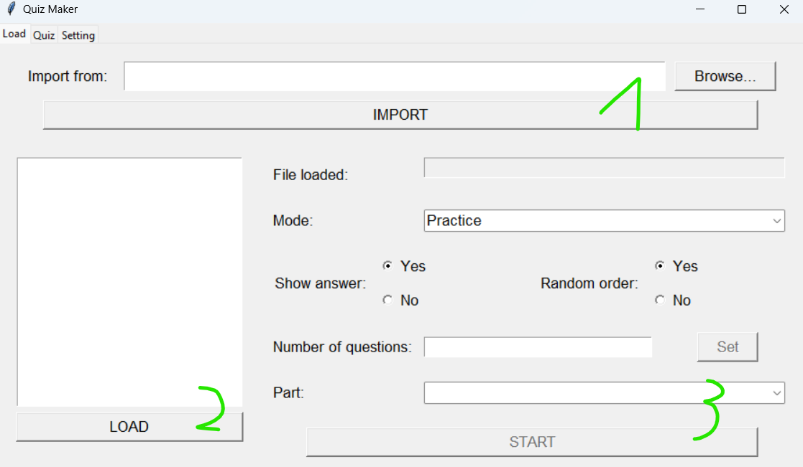

# Quiz Maker V1.2

This is a project for fun

Tested on:
- Windows 10, 11
- Ubuntu 20.04, Kali linux 2022.4
- Python version 3.8.10, 3.10.7, 3.10.8, 3.11.3

# Installation

Run file `setup.py` first to install some dependencies by double click (Windows) or run the following command (Linux):

```python
python3 setup.py
```

After it's done, you can run `main.pyw` by double click (Windows) or run the following command (Linux):

```python
python3 main.pyw
```

# Usage

There are 3 tabs in total: `Load`, `Quiz` and `Setting`

## Load



First area will be used to import quiz from file. It is currently support excel extension `.xlsx`, `.xls` and word extension `.docx`, others will be improved in the future! You can scroll down to the [template example](#template) for importing files.

After importing file, the file will be parsed and automatically added to the second area as following:


Select the item and click `LOAD` (You can also double click on the item) and it will be loaded in to program for preparing quiz:


On the third area, there are plenty of things as follows:

- `File loaded`: After you click `LOAD` (or double click on item), this field will display the name of loaded quiz
- `Mode`: There are 2 mode: `Practice` and `Quiz`. Mode `Practice` will let you play and learn quiz with a static order while mode `Quiz` will random the question
- `Show answer`: This option let you see the answer both in `Practice` mode and in `Quiz` mode and will be saved with just button `START`. After you press `START`, changing `Show answer` will not show or hide the answer
- `Random order`: This field is only available in `Practice` mode
- `Number of question`: Choose the number of question you want to play. This option is available for both `Practice` and `Quiz` mode to save the number of question. After you enter the number, make sure to press button `Set`
- `Part`: If you choose `Practice` mode and click `Set`, this field will calculcate the number of parts with each part has `Number of question` you have set. On the other hand, if you choose `Quiz` mode, it will show `random`

## Quiz


On this tab, after you press `START` on tab `Load`, you will see something like that. If you set `Show answer` to yes, choosing an answer will immediately show you if your choice is correct or not by pressing button left arrow or with the list on the right.

The list help you track your progress to make sure no question are left. You can double click the question on the list to go to that question faster.

## Setting


It's just stuff you can play around. With `Quiz font size`, it affects the question and 4 answers on tab `Quiz` only.

## Template

With Excel file, the program support extension `.xlsx` and `.xls`. It will look through 6 columns:

```
----------------------------------------------------------------------------------
| question | answer 1 | answer 2 | answer 3 | answer 4 | correct answer (number) |
----------------------------------------------------------------------------------
```

> Note that correct answer start from 1

Here is 6 columns you will set in Excel with file name `Template.xlsx` (I will include in template folder):


With Word file, the program support only extension `.docx`. The format for word is:

- Line 1: question
- Line 2: answer 1
- Line 3: answer 2
- Line 4: answer 3
- Line 5: answer 4
- Line 6: correct answer (number)

If you want image in the question, the format should be like this:

- Line 1: image
- Line 2: question has prefix `<image>`
- Line 3: answer 1
- Line 4: answer 2
- Line 5: answer 3
- Line 6: answer 4
- Line 7: correct answer (number)

> Note that correct answer start from 1

Here is example for format without image in word (no matter how much newline between them but each item has to be on a different line):


Here is example for format with image:


Download template here:

- [Excel Template (.xlsx)](./template/Template.xlsx)
- [Excel Template (.xls)](./template/Template.xls)
- [Word Template (.docx)](./template/Template.docx)
- [Word Image Template (.docx)](./template/Image-Template.docx)